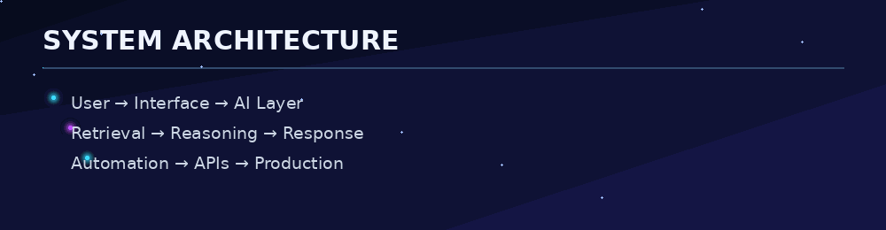
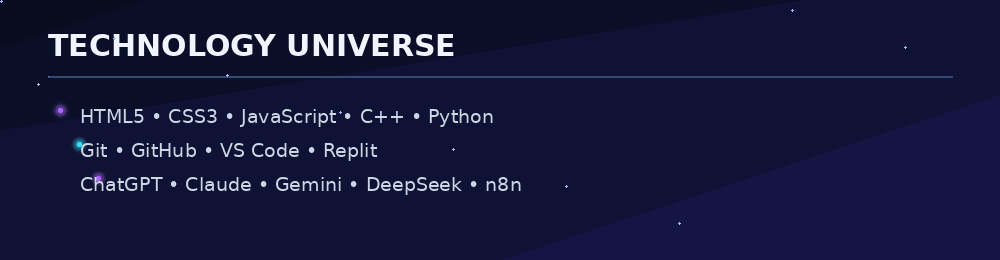
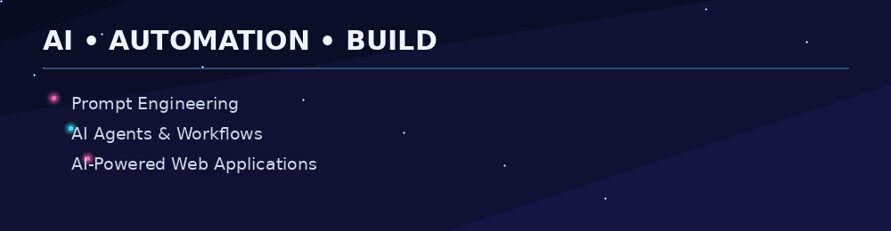

# Hi, I'm Arish Islam 👋

### Web Developer • AI & Prompt Engineering • AI-Powered Applications

I build practical web applications, AI workflows, and developer projects focused on solving real-world problems.

---

## 🧠 What I'm Learning

- 🧠 Data Structures & Algorithms in C++
- 🔧 Creating practical projects that solve real-world problems
- 🌐 Exploring modern web development and AI-powered systems
- 🤖 Building AI agents, automation workflows, and useful applications

---

## 🛠️ Tech Stack

**Web:** HTML5 · CSS3 · JavaScript  
**Programming:** C++ · Python  
**Tools:** Git · GitHub · VS Code · Replit  
**AI & Automation:** ChatGPT · Claude · Gemini · DeepSeek · Perplexity · Grok · n8n · Lovable · Emergent AI · Antigravity

---

## 🚀 Featured Projects

### ✈️ AI Radar — Live Flight Tracker
Live flight-tracking project focused on aircraft information and an interactive radar-style experience.

[**View Project →**](https://github.com/arish096/AI-Radar---Live-Flight-Tracker-)

### 🍎 Apple Support AI Agent
AI-powered customer-support project using NLP, intent classification, historical case retrieval, evidence-grounded replies, and escalation logic.

[**View Project →**](https://github.com/arish096/apple-support-ai-agent)

---

---

## 🎯 2026 Focus

**C++ & DSA · Web Development · AI Agents · Automation · AI-Powered Applications**

### Let's build something useful. ⚡

