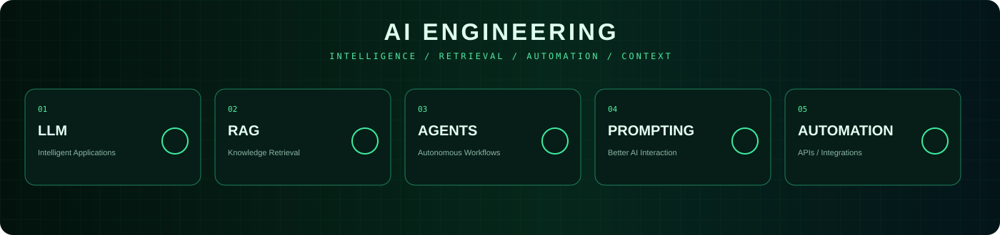
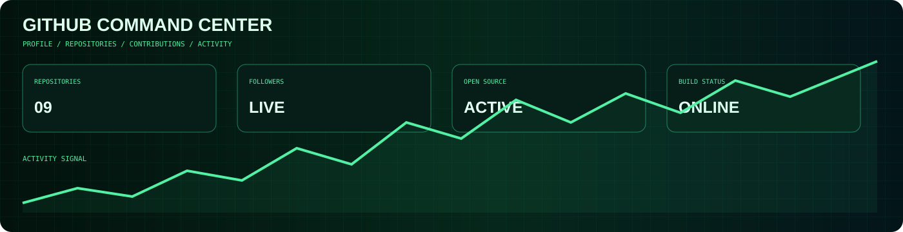
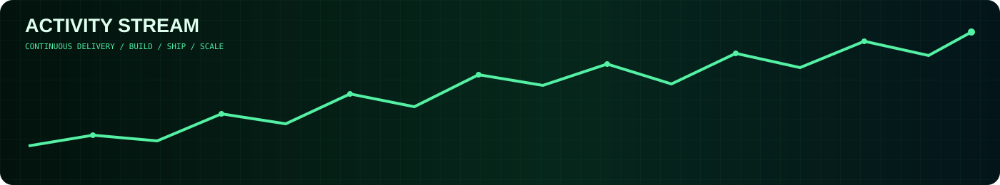

<table>
<tr>
<td width="30%" valign="top">

  

### ARISH ISLAM

`WEB DEVELOPER`  
`AI ENGINEER`  
`PROMPT ENGINEER`

 

  

**LOCATION**  
🌐 Worldwide

**PROFILE**  
[github.com/arish096](https://github.com/arish096)

</td>

<td width="70%" valign="top">

# Engineering With Purpose

I design and build modern software systems across the **frontend, backend, cloud, data, and AI layers.**

My focus is turning complicated product requirements into clean, scalable, secure and maintainable systems.

| Frontend | Backend |
|---|---|
| React · Next.js · TypeScript | Node.js · Python · C++ |
| Cloud | AI |
| AWS · Docker · CI/CD | LLM · RAG · AI Agents |

</td>
</tr>
</table>

---

# `SYSTEM ARCHITECTURE`

`REQUEST FLOW / SERVICE MESH / DATA / INFRASTRUCTURE`

---

# `TECHNOLOGY UNIVERSE`

---

# `AI ENGINEERING`

---

# `FEATURED PROJECTS`

<table>
<tr>
<td width="33%" valign="top">

### ✈️ AI RADAR

Live flight tracking and radar-style visualization.

`React` `TypeScript` `Node.js`

[VIEW PROJECT →](https://github.com/arish096/AI-Radar---Live-Flight-Tracker-)

</td>

<td width="33%" valign="top">

### 🍎 APPLE SUPPORT AI

AI customer-support system with retrieval and intent classification.

`Python` `NLP` `Streamlit`

[VIEW PROJECT →](https://github.com/arish096/apple-support-ai-agent)

</td>

<td width="33%" valign="top">

### 🩺 MEDVITALS.AI

Multimodal AI assistant for educational workflows.

`Python` `AI` `Streamlit`

[VIEW PROJECT →](https://github.com/arish096/MedVitals.AI)

</td>
</tr>

<tr>
<td width="33%" valign="top">

### 🧠 DSA IN C++

Structured DSA and problem-solving repository.

`C++` `Algorithms` `DSA`

[VIEW PROJECT →](https://github.com/arish096/DSA-IN-Cpp)

</td>

<td width="33%" valign="top">

### 🎨 AI THUMBNAIL GENERATOR

AI-powered YouTube thumbnail creation.

`TypeScript` `AI` `Web`

[VIEW PROJECT →](https://github.com/arish096/ai-youtube-thumbnail-generator)

</td>

<td width="33%" valign="top">

### 🎓 THESIS LEARN

AI learning assistant for CBSE, JEE and NEET.

`TypeScript` `AI` `Education`

[VIEW PROJECT →](https://github.com/arish096/thesis-learn-App)

</td>
</tr>
</table>

---

# `GITHUB COMMAND CENTER`

<table>
<tr>
<td align="center">

</td>
<td align="center">

</td>
<td align="center">

</td>
</tr>
</table>

---

# `ACTIVITY STREAM`

---

# `CONTRIBUTION MATRIX`

---

### `BUILD • SHIP • LEARN • REPEAT`

