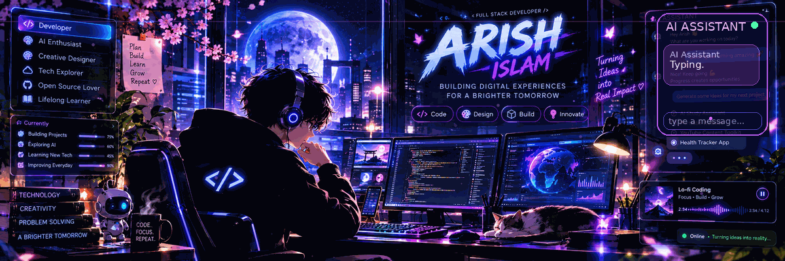

 

# 💜 ARISH ISLAM

### Web Developer · AI & Prompt Engineering · AI-Powered Applications

 

  

---

## 🌌 ABOUT.ME

> **Building useful things at the intersection of Web Development, AI, and Automation.**

I build practical web applications and explore **AI, prompt engineering, AI workflows, and automation** while strengthening my problem-solving foundation through **DSA with C++**.

AI-Powered Apps · AI Agents · Automation · Web Development · DSA

---

## 🪐 TECHNOLOGY UNIVERSE

### 🌐 FRONTEND

 

### ⚙️ BACKEND & DATABASE

 

### 🤖 AI & PROGRAMMING

 

### 🛠️ TOOLS & PLATFORMS

---

## 🤖 AI TOOLKIT

---

## 🚀 FEATURED PROJECTS

### ✈️ AI Radar — Live Flight Tracker

AI-powered live flight tracker using **OpenSky Network API, React, Leaflet, Node.js, TypeScript and MCP** for real-time aircraft tracking and intelligent flight data.

  

### 🍎 Apple Support AI Agent

AI-powered customer-support agent with **intent classification, historical retrieval, grounded replies, and safe escalation**.

  

### 🏥 MedVitals.AI

AI-powered assistant built with **Python and Streamlit**, supporting symptom analysis, medical images, videos, voice input, voice responses, PDF reports and chat history.

  

### 🧠 DSA in C++

A structured DSA journey in **C++**, focused on beginner-friendly solutions, patterns and problem-solving practice.

  

### 🎨 AI YouTube Thumbnail Generator

AI-powered thumbnail creation platform built with **Lovable AI / TypeScript**.

---
<!-- ==================== GITHUB COMMAND CENTER ==================== -->

<h2 align="left">📊 GITHUB COMMAND CENTER</h2>

  
  

 

  

 

  

<!-- ==================== END GITHUB COMMAND CENTER ==================== -->
---

## 🎯 LEARNING & MISSION

DSA with C++ · AI Agents · AI Automation · Web Development

  

⚡ **Build** practical AI-powered applications  
🧠 **Improve** DSA and problem solving with C++  
🤖 **Create** useful AI agents and workflows  
🌐 **Explore** modern web development  
📚 **Document** projects and learning consistently

---

## 🌐 PORTFOLIO

### **ARISH ISLAM · DIGITAL WORKSPACE**

  

---

## 💜 CONNECT

---

### BUILD · LEARN · EXPERIMENT · REPEAT

