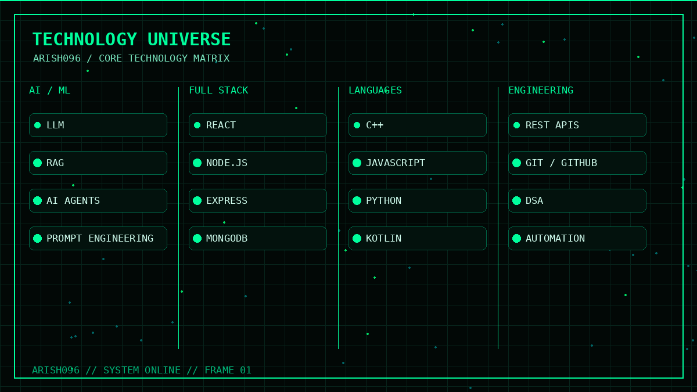
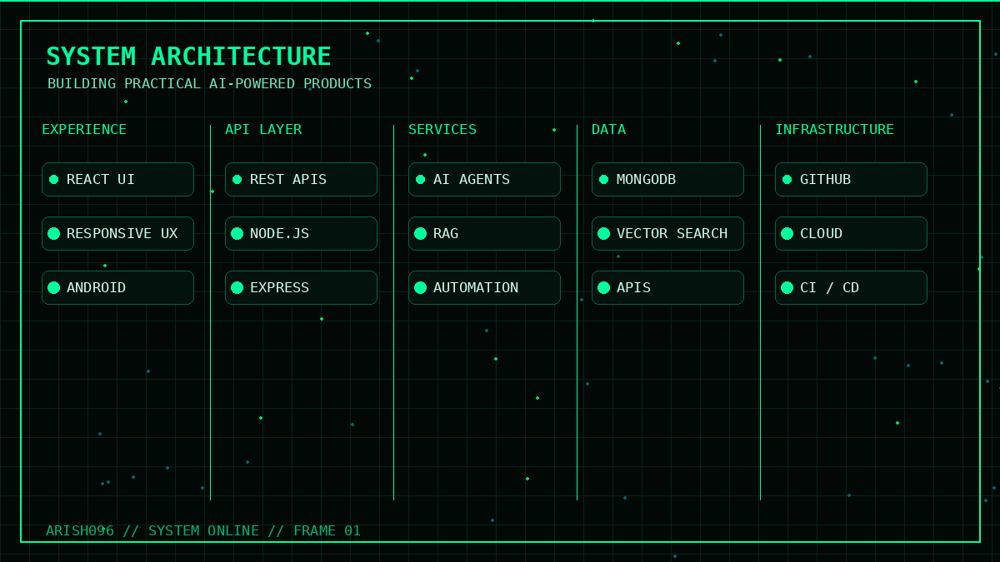
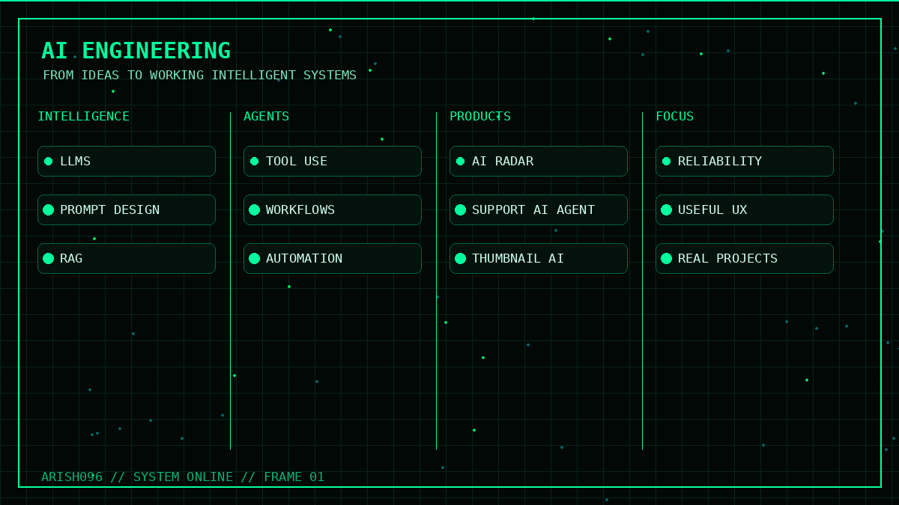

<h2>Engineering With Purpose</h2>

I build practical software across <strong>AI, full-stack development,
automation, and problem solving</strong> — turning ideas into useful products.

<h2>Selected Projects</h2>

| Project | Focus |
|---|---|
| AI Radar / Live Flight Tracker | AI + real-time data |
| Apple Support AI Agent | AI agent / support workflow |
| MedVitals.AI | AI-powered application |
| AI YouTube Thumbnail Generator | Creative AI tooling |
| DSA-IN-Cpp | Data structures & algorithms |
| thesis-learn-App | Application development |

ARISH096 // LEARN → BUILD → SHIP → ITERATE

