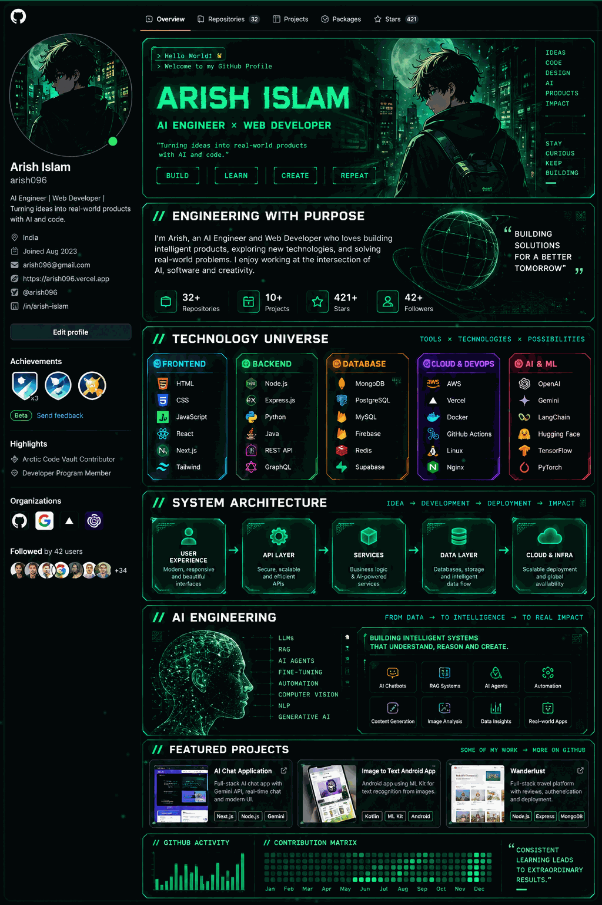

# ARISH096

### AI Engineer × Web Developer

## Engineering With Purpose

I build practical software across **AI, full-stack development, automation, and problem solving** — turning ideas into useful real-world products.

### Focus

- AI / LLM / RAG / AI Agents
- Full-Stack Web Development
- C++ / DSA
- Automation & Developer Tools

### Selected Projects

| Project | Focus |
|---|---|
| AI Radar / Live Flight Tracker | AI + real-time data |
| Apple Support AI Agent | AI agent / support workflow |
| MedVitals.AI | AI-powered application |
| AI YouTube Thumbnail Generator | Creative AI tooling |
| DSA-IN-Cpp | Data structures & algorithms |
| thesis-learn-App | Application development |

---

**LEARN → BUILD → SHIP → ITERATE**

