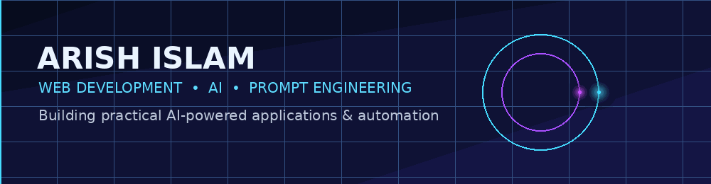
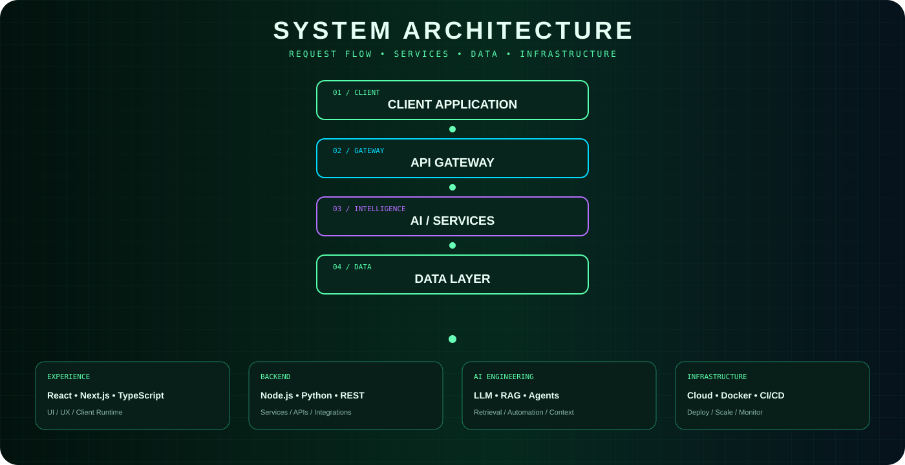
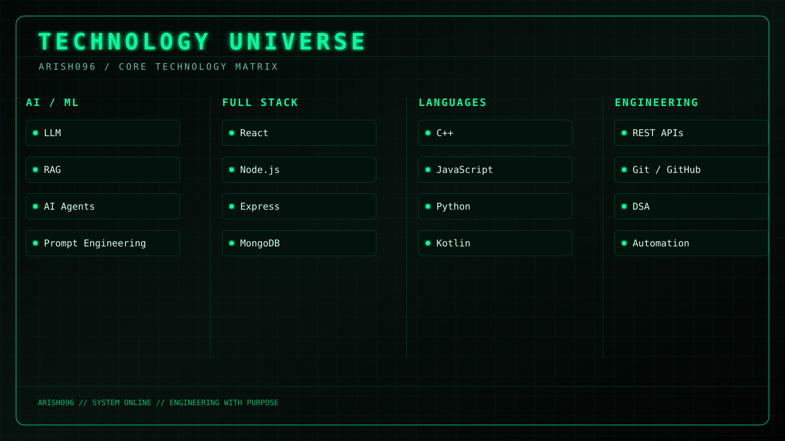

<div align="center">



<br><br>


</div>

---

<table>
<tr>
<td width="30%" align="center">


<br><br>


<br><br>


</td>

<td width="70%">

# `>_ ARISH ISLAM`

### **Web Developer · AI & Prompt Engineering · C++ DSA**

I build **AI-powered applications, intelligent workflows, automation systems and modern web experiences.**

```text
SYSTEM STATUS
────────────────────────────────────────
● AI APPLICATIONS       BUILDING
● WEB DEVELOPMENT       ACTIVE
● PROMPT ENGINEERING    EXPLORING
● AI AUTOMATION         EXPLORING
● DSA / C++             LEARNING
────────────────────────────────────────
```

> **Turning ideas into real-world software.**

</td>
</tr>
</table>

---

## `01 / SYSTEM ARCHITECTURE`

<div align="center">

</div>

---

## `02 / TECHNOLOGY UNIVERSE`

<div align="center">

</div>

---

## `03 / AI ENGINEERING`

<div align="center">

```text
╔════════════════════════════════════════════════════════════╗
║                     AI SYSTEM CORE                        ║
╠════════════════════════════════════════════════════════════╣
║  LLMs          → Intelligent Applications                  ║
║  Prompting     → Better AI Interaction                     ║
║  RAG           → Knowledge Retrieval                       ║
║  AI Agents     → Autonomous Workflows                      ║
║  Automation    → APIs / Integrations / Context             ║
╚════════════════════════════════════════════════════════════╝
```

`LLMs` · `RAG` · `AI Agents` · `Prompt Engineering` · `Automation` · `AI APIs`

</div>

---

## `04 / FEATURED PROJECTS`

<table>
<tr>
<td width="50%" valign="top">

### ✈️ AI RADAR
**Live Flight Tracker**

Real-time aircraft tracking with an interactive radar-style interface.

`React` `TypeScript` `Node.js` `Leaflet` `OpenSky API` `MCP`

<a href="https://github.com/arish096/AI-Radar---Live-Flight-Tracker-">VIEW PROJECT →</a>

</td>
<td width="50%" valign="top">

### 🍎 APPLE SUPPORT AI AGENT

AI customer-support agent with intent classification, retrieval, grounded responses and escalation.

`Python` `NLP` `TF-IDF` `Streamlit`

<a href="https://github.com/arish096/apple-support-ai-agent">VIEW PROJECT →</a>

</td>
</tr>

<tr>
<td width="50%" valign="top">

### 🩺 MEDVITALS.AI

Multimodal AI assistant supporting text, medical images, video and voice workflows.

`Python` `Streamlit` `OpenRouter`

<a href="https://github.com/arish096/MedVitals.AI">VIEW PROJECT →</a>

</td>
<td width="50%" valign="top">

### 🧠 DSA IN C++

A structured DSA journey with problem-solving practice.

`C++` `Arrays` `Searching` `Sorting` `Algorithms`

<a href="https://github.com/arish096/DSA-IN-Cpp">VIEW REPOSITORY →</a>

</td>
</tr>

<tr>
<td width="50%" valign="top">

### 🎨 AI YOUTUBE THUMBNAIL GENERATOR

AI-powered thumbnail creation project.

`TypeScript` `AI` `Web`

<a href="https://github.com/arish096/ai-youtube-thumbnail-generator">VIEW PROJECT →</a>

</td>
<td width="50%" valign="top">

### 🎓 THESIS LEARN

AI-powered learning assistant for **CBSE · JEE · NEET**.

`TypeScript` `AI` `Education`

<a href="https://github.com/arish096/thesis-learn-App">VIEW PROJECT →</a>

</td>
</tr>
</table>

---

## `05 / GITHUB COMMAND CENTER`

<div align="center">


<br><br>


</div>

---

## `06 / ACTIVITY STREAM`

<div align="center">


</div>

---

## `07 / CONTRIBUTION MATRIX`

<div align="center">


</div>

---

## `08 / CURRENT MISSION`

```text
┌────────────────────────────────────────────────────────────┐
│                                                            │
│  AI APPLICATIONS       ██████████████████░░   BUILDING     │
│  WEB DEVELOPMENT       █████████████████░░░   BUILDING     │
│  AI AGENTS             ████████████████░░░░   EXPLORING   │
│  AUTOMATION            ███████████████░░░░░   EXPLORING   │
│  DSA / C++             ██████████████░░░░░░   LEARNING    │
│                                                            │
└────────────────────────────────────────────────────────────┘
```

### Currently Exploring

`AI Agents` · `RAG` · `Advanced Web Development` · `Automation` · `DSA in C++`

---

## `09 / CONNECT`

<div align="center">

<a href="https://github.com/arish096"></a>
&nbsp;
<a href="https://leetcode.com/u/Arish_Islam/"></a>

<br><br>

### `BUILD • LEARN • EXPERIMENT • IMPROVE`


</div>
