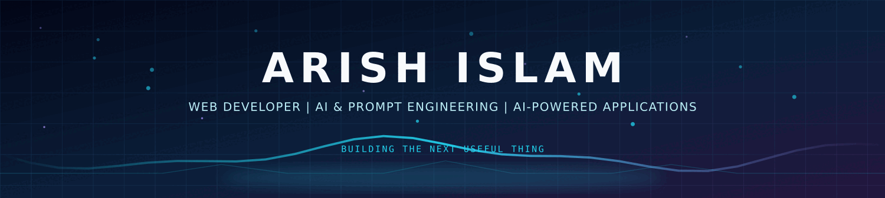

<!-- ========================================================= -->
<!--                     PREMIUM HERO                          -->
<!-- ========================================================= -->

  

<h1>ARISH ISLAM</h1>

<h3>
Web Developer · AI & Prompt Engineering · AI-Powered Applications
</h3>

  

<!-- ========================================================= -->
<!--                    PROFILE INTRO                          -->
<!-- ========================================================= -->

<table align="center" width="96%">
<tr>

<td width="58%" valign="top">

<h2>Engineering With Curiosity</h2>

I build practical software projects across
<strong>Web Development, AI, Prompt Engineering, and Automation.</strong>

My current focus is on creating AI-powered applications,
exploring AI agents and workflows, and strengthening my
problem-solving foundation through <strong>DSA with C++</strong>.

 

<table>
<tr>
<td>

<strong>Web Development</strong> 
HTML5 · CSS3 · JavaScript · React

</td>

<td>

<strong>AI</strong> 
AI Apps · LLMs · Prompt Engineering

</td>
</tr>

<tr>
<td>

<strong>Automation</strong> 
AI Workflows · n8n · AI Agents

</td>

<td>

<strong>Programming</strong> 
C++ · Python · DSA

</td>
</tr>
</table>

</td>

<td width="42%" align="center">

<h2>⚡ CURRENT FOCUS</h2>

🚀 AI-Powered Applications

  

🤖 AI Agents & Automation

  

🌐 Modern Web Development

  

🧠 DSA with C++

  

🛠️ Practical Developer Projects

</td>

</tr>
</table>

<!-- ========================================================= -->
<!--                    TECHNOLOGY MATRIX                      -->
<!-- ========================================================= -->

<h2 align="center">🪐 TECHNOLOGY UNIVERSE</h2>

### 🌐 WEB DEVELOPMENT

  

### 🤖 AI & INTELLIGENCE

  

### 🧠 PROGRAMMING & DSA

  

### 🛠️ DEVELOPMENT TOOLS

<!-- ========================================================= -->
<!--                    AI TOOLKIT                             -->
<!-- ========================================================= -->

<h2 align="center">🤖 AI TOOLKIT</h2>

 

<!-- ========================================================= -->
<!--                  FEATURED PROJECTS                        -->
<!-- ========================================================= -->

<h2 align="center">🚀 FEATURED PROJECTS</h2>

### ✈️ AI Radar — Live Flight Tracker

Live flight tracking project focused on real-time aircraft data
and an interactive radar-style experience.

  

### 🍎 Apple Support AI Agent

AI-powered customer support agent using
<strong>Python, NLP, TF-IDF, Logistic Regression and Streamlit</strong>,
with intent classification, historical retrieval,
evidence-grounded replies and AUTO-HANDLE vs ESCALATE decisions.

  

### 🏥 MedVitals AI

Multimodal AI application built with
<strong>Python and Streamlit</strong> for educational exploration
using text, images, video, voice and reports.

  

### 🧠 DSA in C++

My ongoing DSA learning journey in C++ covering
problem-solving fundamentals, arrays, pointers, searching,
sorting and other core concepts.

<!-- ========================================================= -->
<!--                    LEARNING                              -->
<!-- ========================================================= -->

<h2 align="center">🎯 LEARNING & MISSION</h2>

`DSA with C++` · `AI Agents` · `AI Automation` · `Web Development`

  

⚡ Build practical AI-powered applications  
🧠 Improve DSA and problem solving with C++  
🤖 Create useful AI agents and workflows  
🌐 Explore modern web development  
📚 Document projects and learning consistently

<!-- ========================================================= -->
<!--                  GITHUB COMMAND CENTER                    -->
<!-- ========================================================= -->

<h2 align="center">📊 GITHUB COMMAND CENTER</h2>

  

  

<!-- ========================================================= -->
<!--                    PORTFOLIO                              -->
<!-- ========================================================= -->

<h2 align="center">🌐 PORTFOLIO</h2>

<h3>ARISH ISLAM · DIGITAL WORKSPACE</h3>

<!-- ========================================================= -->
<!--                     CONNECT                               -->
<!-- ========================================================= -->

<h2 align="center">💜 CONNECT</h2>

<!-- ========================================================= -->
<!--                     FOOTER                                -->
<!-- ========================================================= -->

 

<h3>BUILD · LEARN · EXPERIMENT · REPEAT</h3>

