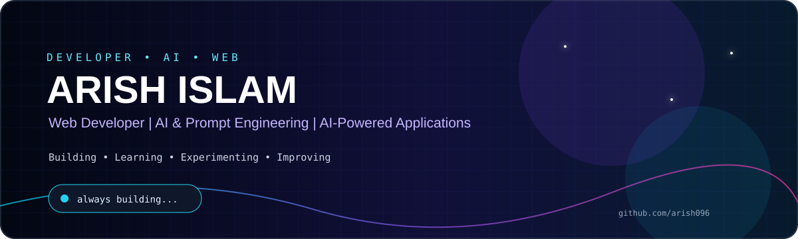
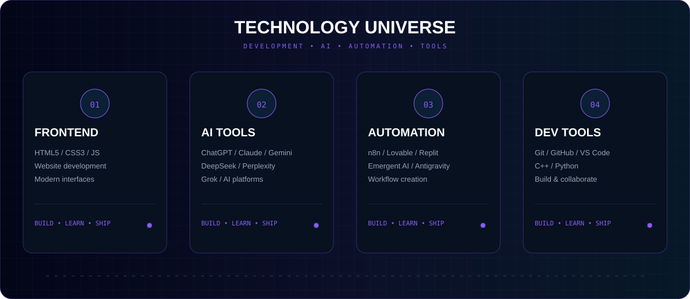

## 👋 About Me

I'm **Arish Islam**, a developer focused on **Web Development, AI, Prompt Engineering, and practical software projects**.

- 💻 Building modern & AI-powered web applications
- 🤖 Exploring AI agents, prompt engineering & automation
- 🧠 Learning Data Structures & Algorithms in C++
- 🔧 Creating practical projects that solve real-world problems
- 🌐 Exploring modern web development and AI-powered systems

---

## 🛠️ Tech Stack

**Web:** HTML5 · CSS3 · JavaScript  
**Programming:** C++ · Python  
**Tools:** Git · GitHub · VS Code · Replit  
**AI & Automation:** ChatGPT · Claude · Gemini · DeepSeek · Perplexity · Grok · n8n · Lovable · Emergent AI · Antigravity

---

## 🌟 Featured Projects

### ✈️ AI Radar — Live Flight Tracker
Live flight-tracking project focused on aircraft information and an interactive radar-style experience.

**[View Project →](https://github.com/arish096/AI-Radar---Live-Flight-Tracker-)**

### 🍎 Apple Support AI Agent
AI-powered customer support system using **Python, NLP, TF-IDF, Logistic Regression & Streamlit** with intent classification, historical case retrieval, evidence-grounded replies, and AUTO-HANDLE vs ESCALATE decisions.

**[View Project →](https://github.com/arish096/apple-support-ai-agent)**

---

## 🧠 Currently Learning

`DSA in C++` · `Problem Solving` · `Modern Web Development` · `AI Agents & Automation` · `AI-Powered Software Systems`

## 📊 GitHub

 

---

## 🎯 2026 Focus

`C++ & DSA` · `Web Development` · `AI Agents` · `Automation` · `AI-Powered Applications`

### ⚡ Build • Learn • Experiment • Improve

